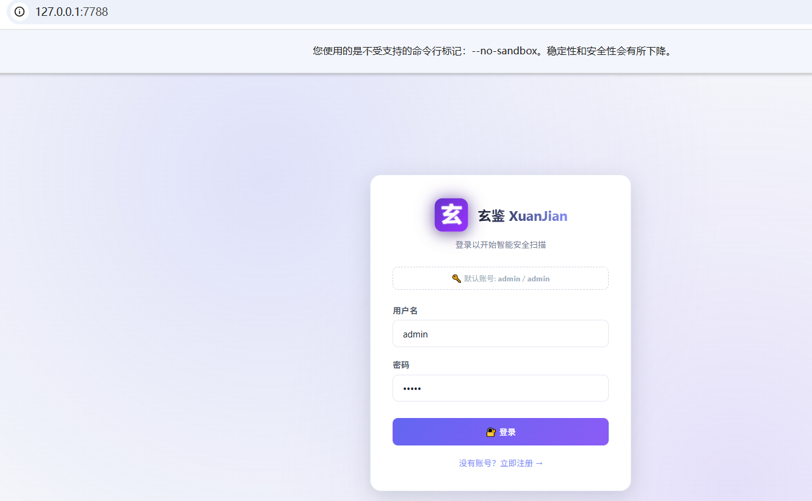
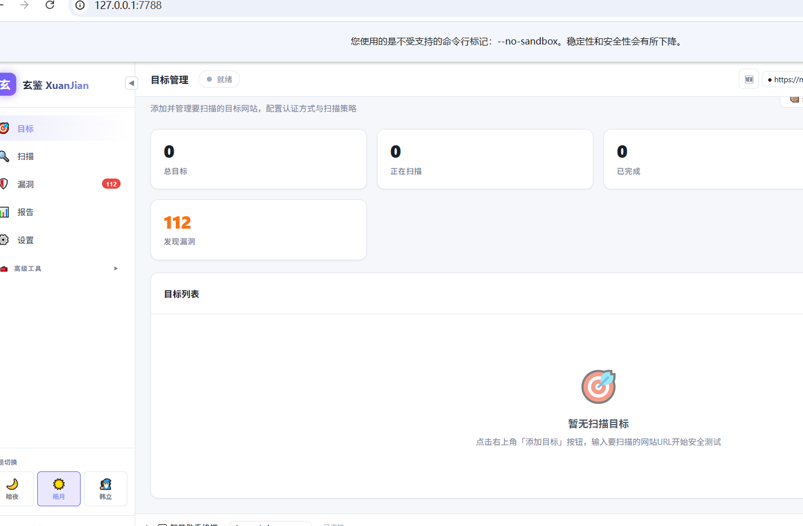
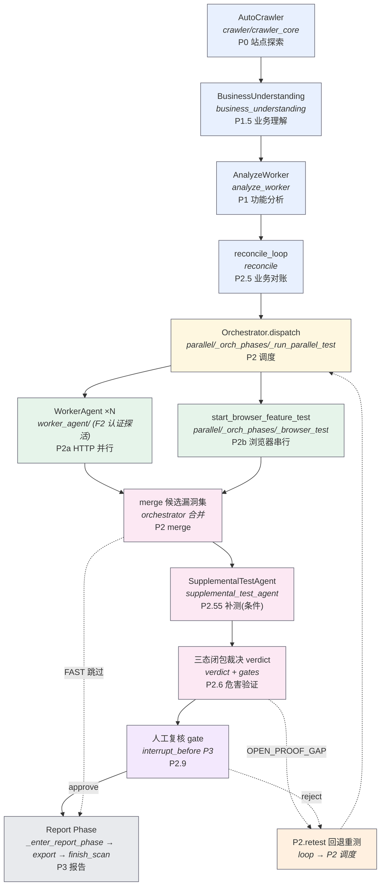

# 玄鉴 XuanJian 智能安全扫描器

**一个驱动浏览器爬取、拦截流量，并按阶段方法论（爬虫→分析→并行编排测试→三态闭包验证→报告）自动执行、自主验证漏洞的自动化渗透测试 Agent**

> 每条漏洞都归属到具体的「接口 × 漏洞域」坐标，并记录在稀疏覆盖矩阵上——既不遗漏任何测试步骤，也能给每个接口一个明确结论。

> **v2.0 稳定版** — 玄鉴是一个持续维护的开源智能渗透测试引擎。
> LLM/Agent/RAG 安全测试能力在 [**鉴微 JianWei**](https://github.com/yzdily/jianwei) 中基于玄鉴引擎持续演进。
> 详见 [ARCHITECTURE.md](ARCHITECTURE.md) · [CHANGELOG.md](CHANGELOG.md)

<p>
  <a href="#平台支持">平台支持</a> •
  <a href="#快速开始">快速开始</a> •
  <a href="#特性">特性</a> •
  <a href="#架构">架构</a> •
  <a href="#知识库">知识库</a> •
  <a href="#贡献">贡献</a>
</p>

---

> ⚠️ **法律声明**：本工具仅供**获得合法授权**的安全测试使用。使用前必须获得目标系统所有者的明确书面授权，并遵守当地法律法规。未经授权使用属于违法行为，使用者自行承担全部法律责任。**使用即表示您已阅读、理解并同意承担全部风险与责任。**详见 [DISCLAIMER.md](DISCLAIMER.md)

> **不是漏扫。** 玄鉴 XuanJian 像真人渗透测试员一样工作——操作浏览器、拦截流量、分析业务逻辑、构造 Payload、验证漏洞、去误报——但永远不会忘记任何一个测试步骤。

## 平台支持

玄鉴原生支持三大桌面平台，按系统选择启动器：

| 操作系统 | 推荐启动器 | 备选 | 说明 |
|---|---|---|---|
| **Windows 10/11** | `.\start.ps1`（PowerShell 5.1+）或 `scripts\launch.bat` | `python start.py` | PowerShell 随 Windows 自带；`launch.bat` 为旧版入口。 |
| **macOS 12+** | `./start.sh` 或在 Finder 中**双击 `start.command`** | `python3 start.py` | `start.command` 会自动打开 Terminal.app 执行。 |
| **Linux（Ubuntu/Debian/Fedora/Arch）** | `./start.sh` | `python3 start.py` | 已在 Ubuntu 22.04+ 测试，其他发行版一般可用但未做 CI。 |
| **Docker（任意宿主机）** | `docker compose up -d` | `make docker-up` | 多架构镜像（linux/amd64、linux/arm64），Web UI：`http://localhost:7788`。 |

> 为什么有三个启动器？`start.py` 已做平台探测（处理 macOS Python.framework 路径、Windows venv 的 `Scripts\`、Linux 的 `~/.local/bin`），包装脚本只是帮你在对应系统选对 Python 解释器。

三个启动器功能等价，最终都是带参数调用 `python start.py`。

---

## 特性

### 🧠 核心能力

| 能力 | 说明 |
|------|------|
| **URL 全流程渗透** | 输入目标 URL，自动完成爬虫、分析、测试、报告 |
| **账号密码登录渗透** | 输入账号密码 + URL，自动登录后渗透 |
| **凭证注入渗透** | 输入 Cookie / JWT / Header，绕过登录直接测试 |
| **手动登录凭证捕获** | Playwright 有头模式手动登录，自动捕获 Cookie/Token/Authorization，支持验证码人工介入 |
| **SPA 智能降级** | 自动检测 Vue/React/Angular SPA，链接不足时切换手动浏览 + 流量录制模式 |
| **验证码自动识别** | 集成 OCR，自动识别图形验证码（复杂验证码支持手动配合） |
| **自定义 SKILL** | 把自己的挖洞经验写成方法论，遇强则强 |

### ⚡ 扫描模式（两个正交维度）

玄鉴的「扫描模式」由**两个正交维度**组合决定，避免混用：

**维度一 · 扫描深度**（决定是否调 LLM、并发、超时、跳过哪些阶段）

| 深度 | LLM | 适用场景 |
|------|-----|---------|
| **FAST** | 否（纯本地规则） | 快速过一遍，去误报由检测层硬规则保证 |
| **STANDARD** | 部分（精简调用） | 日常渗透，平衡速度与深度 |
| **DEEP** | 完整全流程 | 全量 LLM 分析 + 危害验证 |
| **SMART** | 自动选择 | 先分析目标再选 FAST/STANDARD/DEEP |

**维度二 · 编排方式**（决定任务如何编排）

| 编排 | 流程 | 适用场景 |
|------|------|---------|
| **批处理 (Batch)** | 爬虫 → 分析 → 并行测试 → 报告 | 全站渗透，全自动 |
| **实时 (Realtime)** | 发现即测，边点边出结果 | 快速验证 |
| **包测 (Packet)** | 单个 HTTP 数据包跑漏洞 Checklist | Burp 联动，定点测试 |

> 两个维度独立选择，例如「FAST × Batch」= 不调 LLM 的全站并行扫描，「DEEP × Realtime」= 全流程 LLM 的边爬边测。代码中深度维度对应 `ScanMode` / `session.user_scan_mode`，编排维度对应 `session.scan_mode`。

### 🔧 工程化能力

| 能力 | 说明 |
|------|------|
| **多会话管理** | 支持同时多个渗透任务（有并发限制） |
| **流量管理** | mitmproxy 全量流量查看、搜索、重放 |
| **决策回放** | 回溯渗透过程每一步的 LLM 决策链 |
| **日志回溯** | 完整的 LLM 调用 + Agent 行为日志 |
| **经验沉淀** | 历史漏洞经验自动学习，同类目标复用 |
| **自定义报告模板** | 支持自定义报告输出格式 |
| **合规报告** | 内置合规报告模板，支持漏洞统计与修复追踪 |
| **模型热切换** | 10 个 LLM 随意切换，Web UI 一键完成 |
| **用量观测** | LLM 调用次数 / Token 消耗 / 费用实时监控 |

### 🛡️ 漏洞检测

基于浏览器驱动 + 流量拦截 + LLM 深度分析，自动检测并验证以下类型漏洞：

- **Web 注入类**：SQL 注入（内置 Fuzz 引擎）、XSS（反射/存储/DOM，内置 13-step 专项引擎）
- **认证授权类**：IDOR 越权、认证绕过、未授权访问
- **服务端类**：SSRF（含 OOB 带外验证 + 危害证明）、信息泄露、竞态条件
- **业务逻辑类**：验证码绕过、用户枚举、业务逻辑分析
- **其他**：CSRF、XXE、SSTI、文件上传、路径穿越、命令注入

- **智能渗透**：浏览器驱动 + 流量拦截改包 + 业务理解 + JS 深度分析 + 前端加密突破
- **危害验证**：独立 LLM 审核员验证漏洞真实危害，按 SRC 标准去误报
- **检测层假阳性铁律**：FastScanner 在检测阶段即执行硬规则过滤，不依赖事后 LLM 裁决（详见下文）
- **补测机制**：扫描全量流量，发现遗漏的新 API 自动补测
- **PoC 生成**：自动生成漏洞 PoC 脚本，便于复现与提交
- **可扩展**：用户可自定义 SKILL，支持任意漏洞类型

### 🚫 假阳性防护体系

借鉴 [api-pentest-extension](https://github.com/yzdily/api-pentest-extension) 的「假阳性判定铁律」框架，在检测层（而非事后 LLM 裁决）执行确定性过滤，确保即使 FAST 模式跳过危害验证也能有效去误报：

| 防护层 | 机制 | 覆盖漏洞类型 |
|--------|------|-------------|
| **业务错误码解析** | HTTP 200 但响应体含 `code:500`/`message:用户未登录` 等业务拒绝码 → 不报未授权访问 | 未授权访问、CORS、信息泄露 |
| **空 data 检测** | 200 但 `data:null`/`data:[]` → 无数据泄露，不报漏洞 | 未授权访问、CORS |
| **WAF 拦截页识别** | 403/418/429/503 + `blocked`/`firewall`/`拦截` 关键词 → 跳过，不算漏洞 | 目录穿越、命令注入、SSRF |
| **响应归一化** | 布尔盲注比较前剥离时间戳/JWT/CSRF token/hash 等动态内容 | SQL 注入 |
| **SQL 布尔盲注三层校验** | True≈基线 + False=WAF/错误页 → 跳过；True≈基线 + False≈基线 → 参数被忽略 | SQL 注入 |
| **时间盲注二次复现** | 延迟≥3.5s 且必须二次复现才算确认，排除网络抖动 | SQL 注入 |
| **XSS 可执行上下文** | 探针在 HTML 注释/纯 JSON/textarea 中 → 降级为弱证据 | XSS |
| **证据质量分级** | 所有漏洞设置 `body_confirmed`/`header_only` 标签，供二次裁决参考 | 全部漏洞类型 |
| **命令注入特征收紧** | 移除 `whoami`/`total` 等通用词，要求命令输出特征 + 排除 payload 反射 | 命令注入 |
| **SSRF 特征收紧** | 弱证据分支要求内网服务特征（Apache/nginx 标题等），支持 OOB 带外验证 | SSRF |
| **登录接口白名单** | 登录/认证类接口跳过未授权访问检测，避免误报 | 未授权访问 |
| **CSRF Token 名扩展** | 扩展 CSRF Token 名识别列表，减少误报 | CSRF |

### 🔌 多入口

- **Web UI** — 对话式交互、多会话管理、实时报告、凭证注入登录
- **Burp Suite 插件** — 右键发送 + 被动扫描 + SSE 实时反馈
- **REST API** — 支持第三方集成和自动化流水线

---

## 快速开始

### 方式一：一行命令（各平台）

```bash
# --- macOS / Linux（bash）---
git clone https://github.com/yzdily/xuanjian.git
cd xuanjian
./start.sh

# --- Windows（PowerShell）---
git clone https://github.com/yzdily/xuanjian.git
cd xuanjian
.\start.ps1

# --- Windows（cmd，旧版）---
git clone https://github.com/yzdily/xuanjian.git
cd xuanjian
scripts\launch.bat
```

启动器在启动 Web UI 前会做 5 步环境自检（Python 版本、依赖、`.env`、浏览器、端口），缺什么会明确提示。

### 方式二：手动逐步安装（macOS / Linux）

> **环境要求**：Python >= 3.10

```bash
# 1. 克隆仓库
git clone https://github.com/yzdily/xuanjian.git
cd xuanjian

# 2. 安装依赖
pip install -r requirements.txt

# 3. 下载浏览器内核
python -m playwright install chromium

# 4. 配置 LLM（也可启动后在 WebUI 添加）
cp .env.example .env      # 编辑填入 API Key

# 5. 一键启动
python start.py

# 6. 打开 Web 控制台
#    http://localhost:7788
```

> 国内下载 Chromium 慢？先设置镜像：
> ```bash
> export PLAYWRIGHT_DOWNLOAD_HOST=https://npmmirror.com/mirrors/playwright
> ```

### 方式三：Docker（无需装 Python）

```bash
git clone https://github.com/yzdily/xuanjian.git
cd xuanjian
docker compose up -d
```

打开 `http://localhost:7788` 访问 Web UI。容器以非 root 运行、丢弃全部 capability、Web/代理端口仅绑定 `127.0.0.1`。详见 [docker-compose.yml](docker-compose.yml)。

### 打开 Web UI

启动后浏览器打开 **http://localhost:7788**。首次运行若跳过配置，系统会提示在 **设置 → 模型** 中添加 LLM API Key。

### Make 命令（跨平台）

若装有 GNU make（Windows 用 Git Bash，或其他 Unix shell）：

```bash
make help         # 显示全部命令
make install      # pip install -r requirements.txt
make browser      # playwright install chromium
make run          # python start.py
make doctor       # 环境自检
make test         # pytest
make docker-up    # docker compose up -d
make docker-down  # docker compose down
make clean        # 清理 __pycache__ / .pytest_cache / .coverage
```

### Burp Suite 联动

```bash
cd burp-plugin && ./gradlew jar
# Burp → Extender → Add → 选择 build/libs/pentestagent-burp-1.0.0.jar
```

### 截图

**首页突破** — 自动登录并识别首页攻击面：



**多系统并行** — 同时对两个目标系统进行渗透测试：



---

## 架构

全程无需人工干预，分 8 个阶段自动流转：

| 阶段 | 做什么 | 谁执行 |
|------|--------|--------|
| **Phase 0** | 站点探索（爬虫 + JS 分析 + 流量抓取 + SPA 降级） | AutoCrawler |
| **Phase 1.5** | 业务理解（分析业务语义 → 推导攻击假设） | analyze_business |
| **Phase 1** | 功能分析（识别功能点 → 生成 Checklist） | AnalyzeWorker |
| **Phase 2.5** | 业务对账（Checklist 与业务理解交叉验证） | reconcile_loop |
| **Phase 2a** | HTTP 漏洞测试（SQLi / IDOR / 未授权 …） | 3 个子 Agent 并行 |
| **Phase 2b** | 浏览器漏洞测试（XSS / CSRF …） | 主 Agent |
| **Phase 2.55** | 补测（扫描遗漏的 API） | SupplementalTestAgent |
| **Phase 2.6** | 危害验证（去误报：检测层铁律 + LLM 审核员双重过滤） | HarmValidator |
| **Phase 3** | 汇总报告（覆盖矩阵 + 漏洞详情 + 修复建议 + PoC） | 主 Agent |

> **扫描模式**：深度维度（FAST/STANDARD/DEEP/SMART，对应 `ScanMode` / `session.user_scan_mode`）与编排维度（Batch/Realtime/Packet，对应 `session.scan_mode`）两个正交维度独立选择，详见下方「扫描模式」章节。

模块级流水线，每个节点都是一个真实的 `core.*` 模块：



> 图的相位编号与上方八相位表一致（业务理解 = Phase 1.5，业务对账 = Phase 2.5）。图内流程顺序遵循 `core/graph/` 参考实现（业务理解先于功能分析），与八相位表的 `advance_mixin` 顺序不同；P2.9 人工复核为可选 interrupt gate（`interrupt_before P3`），默认 8 相位全自动流转。

### 新一代测试编排（`core/testflow/`，可选启用）

玄鉴正在围绕 **8 个风险域** —— `authz`（授权）、`csrf`、`upload`（上传）、`ssrf`、`injection`（注入）、`file`（文件）、`business`（业务逻辑）、`config`（配置）—— 重组测试流，该分类源自实战验证的 bug-legacy 方法论。它以确定性的「按域归属测试」取代原先分散在各阶段的临时逻辑：

- **漏洞域归属**：每个接口端点会被归类到一个或多个风险域（一个端点可命中多个域），多域端点会对每个相关域逐一测试。
- **稀疏覆盖矩阵**：每条漏洞都带上其 `(接口, 漏洞域)` 坐标，并标记为五种状态（`verified` 已确认 / `pending` 待复核 / `no_issue` 无问题 / `ruled_out` 已排除 / `not_applicable` 不适用），为「每个接口 × 每个域」提供覆盖证明。
- **七道闸门（G0–G6）**：授权门 → 端点真实性门 → 响应真实性门 → 配对完整性门 → 漏洞验证门 → 覆盖完整性门 → 报告门，贯穿全流程，压制误报并确保每条漏洞都带可追溯证据（`evidence_request` / `evidence_response`）。

该引擎通过环境变量 `XUANJIAN_TESTFLOW_V2`（`census` / `playbook` / `full`）**可选启用**。未设置该 flag 时，上方传统的 8 相位流程保持不变。详见 `core/testflow/engine.py`。

---

## 知识库

玄鉴 XuanJian 不像传统漏扫靠内置规则，而是靠 **SKILL 方法论驱动**。每个漏洞类型对应一个实战方法论，Agent 自动加载并按步骤执行测试，用户也可自定义扩展。

```
skills_my/
├── discovery/                # 漏洞发现方法论
│   ├── builtin/
│   │   ├── _core/       (9)  渗透哲学 / 入口点映射 / 攻击面发现 / 认证绕过 …
│   │   ├── _phase/     (10)  爬虫策略 / JS 提取 / 被动侦察 / 业务分析 …
│   │   └── tech-stack/  (1)  国产技术栈指纹
│   └── personal/
│       ├── auth/        (2)  IDOR 越权 / 验证码绕过
│       ├── csrf/        (1)  CSRF 检测方法论
│       └── sqli/        (1)  SQL 注入检测方法论
├── exploit/                  # 漏洞利用方法论
│   ├── exploit-ssrf/    (1)  SSRF 危害证明
│   └── spring-jndi-exploit/ (1) Spring JNDI 注入利用
└── wooyun-legacy-main/       # Wooyun 历史漏洞知识库
    ├── categories/     (15)  SQL注入 / XSS / SSRF / 命令执行 / 逻辑漏洞 …
    ├── knowledge/       (8)  分类漏洞知识参考
    └── examples/        (2)  银行渗透 / 电信渗透实战案例
```

> ⚠️ **许可证注意**：`skills_my/wooyun-legacy-main/` 为 **CC-BY-NC-SA-4.0（非商业）**
> 第三方内容，与主项目 MIT License 冲突，**禁止商业使用**。主 SKILL 库
> （`discovery/`/`exploit/`）为 MIT，可商业使用。详见
> [skills_my/wooyun-legacy-main/LICENSE_NOTICE.md](skills_my/wooyun-legacy-main/LICENSE_NOTICE.md)。

> 📖 把你的挖洞经验写成 SKILL

---

## 与同类工具对比

| 能力 | 玄鉴 XuanJian | 传统漏扫<br>(AWVS/Xray) | AI 辅助分析<br>(burp-ai-agent) |
|------|:-----------:|:-------------------:|:-------------------------:|
| 业务逻辑理解 | ✅ LLM 深度理解 | ❌ | 🟡 仅建议 |
| 自动构造 Payload | ✅ | ✅ 误报多 | ❌ |
| 检测层假阳性铁律 | ✅ 硬规则过滤 | ❌ | ❌ |
| 危害验证去误报 | ✅ 独立审核 | ❌ | ❌ |
| 浏览器交互 | ✅ Playwright | ❌ | ❌ |
| SPA 智能降级 | ✅ 手动浏览+流量录制 | ❌ | ❌ |
| 前端加密突破 | ✅ CryptoHook | ❌ | ❌ |
| 方法论驱动 | ✅ SKILL 引擎 | ❌ | ❌ |
| 经验学习 | ✅ Memory | ❌ | ❌ |
| PoC 自动生成 | ✅ | ❌ | ❌ |
| 报告质量 | 灵活模版+合规报告 | 需人工整理 | 无报告 |

---

## 目录结构

```
├── core/              # Agent 核心引擎
│   ├── session/       #   分阶段状态机（base + 各阶段 mixin）
│   ├── crawler/       #   Playwright 爬虫（crawler_core + SPA/表单/登录等 mixin + _blocklist 黑名单）
│   ├── xss/           #   XSS 专项引擎（13-step，含 DOM/OOB/上传/CSP 等）
│   ├── parallel/      #   并行调度（orchestrator + _orchestrator_helpers + batch_test）
│   ├── harm_validation/ #  危害验证 + 假阳性过滤（validator + render + _render_helpers）
│   ├── sitemap/       #   站点地图 + Checklist + 路径过滤
│   ├── fast_scanner/  #   快速检测引擎（11 子模块：_engine + FP 硬规则 _fp_filters + 各类 _checks_*）
│   ├── llm/           #   LLM 客户端（10 子模块：_client + _pool + _response_cache + _tokens 等）
│   ├── js_analyzer/   #   JS 深度分析（9 子模块：_extractors + _patterns + _cache + _llm 等）
│   ├── browse_worker/ #   浏览器浏览 Worker（5 子模块：_menu_parser + _menu_grouper + _ledger + _worker）
│   ├── dir_scanner/   #   目录扫描（5 子模块：_constants + _wordlist + _models + _scanner）
│   ├── supplemental_test_agent/ # 补测 Agent（5 子模块：_discovery + _attach + _runner）
│   ├── worker_agent/  #   渗透 Worker Agent（3 子模块：_agent + _helpers mixin）
│   ├── fuzz/          #   Fuzz 引擎（sqli + race_condition + waf_bypass）
│   ├── crypto_replay/ #   前端加密回放（learner + applier + store）
│   ├── scripted_scan/ #   脚本化扫描（OpenAPI 导出 + runner）
│   ├── credential_injector.py  # 独立凭证注入器（手动登录）
│   ├── false_positive_manager.py # 误报追踪管理
│   ├── poc_generator.py  # PoC 自动生成
│   ├── compliance_report.py # 合规报告
│   └── port_scanner.py   # 端口扫描
├── web/               # Web UI + FastAPI
│   └── api/           #   REST API（含凭证注入 API）
├── mcp_servers/       # MCP 工具服务
├── burp-plugin/       # Burp Suite 插件 (Java)
├── crypto_hook/       # Frida 前端加密拦截
├── skills_my/         # 方法论知识库 + Wooyun 历史漏洞库
├── image/             # README 截图
├── docs/              # 项目文档
├── tests/             # 单元测试（含假阳性防护、SPA、竞态条件等）
└── data/              # 运行时数据 (gitignored)
```

> **包拆分说明**：标注「N 子模块」的包均由原单文件 God File 拆分而来（如 `fast_scanner.py` 3991 行 → `fast_scanner/` 11 子模块）。所有公开/私有名通过 `__init__.py` re-export 保持向后兼容，`from core.fast_scanner import FastScanner` 等导入路径不变。

---

## 常见问题排查

### Windows：Web UI 启动报 `WinError 10013`（"以一种访问权限不允许的方式"）

玄鉴默认 Web UI 端口为 **7788**。Windows 会通过 Hyper-V / WinNAT / Docker 等机制预留整段端口区间，任何程序都无权绑定。若 `7788` 恰好落在预留区间内，`uvicorn` 就会报 `[WinError 10013]`，但 `netstat` 里却看不到任何进程在监听它。

在本机查看预留区间：

```bash
netsh interface ipv4 show excludedportrange protocol=tcp
```

解决办法——用 `WEB_PORT` 环境变量换一个**不在预留区间**的端口（如 `8000`、`8080`、`9000`）：

```bash
WEB_PORT=8000 python start.py     # 然后访问 http://localhost:8000
```

> Docker / Linux / macOS 不受影响——`7788` 只在该端口被 Windows 主机预留时才出问题，因此默认值保持 `7788` 不变，容器部署照常工作。

### Windows：`PROXY_PORT`（18080）端口被占用

这**不是**错误。玄鉴会自动复用 18080 上已有的 `mitmproxy` 实例（日志提示"端口 18080 已有 mitmproxy 运行中，将复用现有实例"）。若想强制拉起全新实例，先结束旧进程：

```powershell
# 先用 netstat -ano | findstr :18080 查到 PID
taskkill /PID <pid>          # 优雅结束
taskkill /F /PID <pid>       # 强制结束
```

### 环境变量（全平台）

| 变量 | 默认值 | 作用 |
|---|---|---|
| `WEB_PORT` | `7788` | Web UI 监听端口 |
| `PROXY_PORT` | `18080` | mitmproxy 代理端口 |
| `XUANJIAN_TESTFLOW_V2` | _(未设置)_ | 可选启用新一代测试编排：`census`（仅归属+普查）、`playbook`（+ 域 playbook）、`full`（全部闸门）。未设置 = 传统 8 相位流程。 |

---

## 贡献

欢迎任何形式的贡献：

- 🐛 提交 Issue — 报告 Bug 或建议新功能
- 📖 [贡献方法论](CONTRIBUTING_SKILLS.md) — 把你挖到的漏洞经验写成可复用的 SKILL
- 🔧 提交 Pull Request — 代码改进、文档修正
- ⭐ 给项目点个 Star，让更多人看到

---

## ⚠️ 法律声明与免责

> **本工具仅供获得合法授权的安全测试使用。未经授权使用属于违法行为。**

玄鉴 XuanJian 是一个安全测试工具，**不是攻击工具**。使用本工具进行任何未经授权的系统、网络或应用的访问和测试，可能违反《中华人民共和国网络安全法》等相关法律法规。

使用者必须：
1. 获得目标系统所有者的**明确书面授权**
2. 遵守当地及国际相关法律法规
3. **对自身行为承担全部法律责任**

**开发者不对因使用本工具而产生的任何直接或间接损失承担责任。**

完整法律条款请阅读 [DISCLAIMER.md](DISCLAIMER.md)。

---

## 📄 License

[MIT](LICENSE)

## 🙏 致谢

本项目基于 [ScareAISec](https://github.com/haibo3434358/ScareAISec) (MIT License, Copyright © 2026 游刃AISec) 修改而来，感谢原作者的开源贡献。在原项目基础上做了以下增强：

- 修复扫描流程关键 bug（策略配置、漏洞验证链路）
- 优化漏洞页面展示与数据源一致性
- 增加 Docker 容器化支持与多架构镜像自动构建
- 完善开源基础设施（requirements.txt、CI/CD、文档）

遵循 MIT 许可证要求，已保留原版权声明与许可证文件。本项目的所有修改同样以 MIT 协议开源。

---

<p align="center">
  <sub>如果你喜欢这个项目，别忘了 ⭐ Star 支持一下！</sub>
</p>
