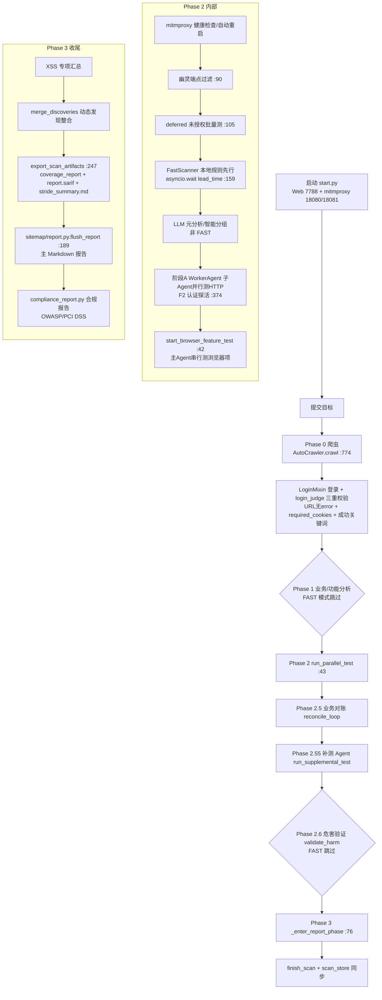

# 玄鉴 XuanJian · 测试流过程 & 技能清单

> 文档用途：对外展示玄鉴的端到端渗透测试工作流与能力边界；内部作为能力与缺口的对齐基线。
> 事实来源：仓库代码实测（2026-09-18 核对），非方案臆测。路径与行号均来自当前代码。

---

## 一、总体架构与两个正交维度

玄鉴是基于 LLM 的自动化渗透测试 Agent。运行时由 `start.py` 拉起 **FastAPI(Web 7788) + mitmproxy(代理 18080 / 管理 18081)**，目标提交后由 `AgentSession.chat()` 相位状态机驱动整条任务。

代码里存在 **两个必须区分的"模式"维度**，否则容易误读：

| 维度 | 取值 | 定义位置 | 含义 |
|---|---|---|---|
| **深度维度** | `FAST` / `STANDARD` / `DEEP` / `SMART` | `core/scan_strategies.py:31-48` | 测试强度、并发、是否跳过阶段 |
| **编排维度** | `batch` / `realtime` / `packet` | `session.scan_mode` | 全站并行 / 边爬边测 / 单包分析 |

### 深度模式行为差异（`ScanConfig.from_mode`，`scan_strategies.py:85-156`）

| 模式 | LLM 并发 | 爬取页数 | 跳过阶段 | 保底清单（FastScanner 兜底） |
|---|---|---|---|---|
| `FAST` | 0（纯规则） | 少 | 业务理解/元分析/补充测试/危害验证 | SQL注入·未授权·信息泄露·弱口令·CORS |
| `STANDARD` | 3 | 60 | 无关键跳过 | — |
| `DEEP` | 5 | 120 | 不跳过任何阶段，总超时 7200s | — |
| `SMART` | 运行时选档 | — | 由 `SmartModeSelector.select_mode()`（`:228-281`）多因子选档：认证复杂度 / 高危关键词(pay/transfer/upload) / SPA·JS 复杂度 → 至少 STANDARD，命中高价值关键词强制 DEEP |

---

## 一.5、八阶段编排（官方架构定义）

"8 阶段编排"是玄鉴官方对其自主渗透流水线的定义，源自 `README.md:241`（"Eight phases, no human in the loop"）与 `ARCHITECTURE.md:21`。**把 Phase 2 的 HTTP 轨道(2a) 与浏览器轨道(2b) 视为同一"漏洞测试"阶段下的两条并行子轨道**，因此 9 个编号行 = **8 个主阶段**，全程无人值守。

| # | 阶段 | 做什么 | 谁执行 | 代码锚点（实测） |
|---|---|---|---|---|
| 0 | 站点探索 | 爬虫 + JS 分析 + 流量抓取(mitmproxy) + SPA 降级 | `AutoCrawler` | `core/crawler/crawler_core.py:445`（`:774 crawl()`） |
| 0.5 | 业务理解 | 语义分析 → 生成攻击假设 | `BusinessUnderstanding` | `core/business_understanding.py` |
| 1 | 功能分析 | 识别功能点 → 生成 Checklist | `AnalyzeWorker` | `core/analyze_worker.py` |
| 1.5 | 业务对账 | Checklist × 业务理解 交叉验证（揪漏测/错测） | 主 Agent | `core/reconcile.py:293 reconcile_loop()` |
| 2 | 漏洞测试 | **2a** HTTP 项(SQLi/IDOR/未授权…) 3 子 Agent 并行；**2b** 浏览器项(XSS/CSRF…) 主 Agent 串行 | `WorkerAgent` / 主 Agent | `core/parallel/_orch_phases/_run_parallel_test.py:43` + `_browser_test.py:42` |
| 2.55 | 补测 | 对扫描遗漏的新发现 API 再测一轮 | `SupplementalTestAgent` | `core/supplemental_test_agent.py`（调度 `_orch_phases/_supplement.py:41`） |
| 2.6 | 危害验证 | 检测层铁律 + LLM 审核员 双重去误报 | `HarmValidator` | `core/harm_validation/validator.py:263 validate_harm()` |
| 3 | 汇总报告 | 覆盖矩阵 + 漏洞详情 + 修复建议 + PoC（含 SARIF/STRIDE/合规） | 主 Agent | `core/parallel/_orch_phases/_report_phase.py:76` + `core/loops/coverage_integration.py:247 export_scan_artifacts()` |

> **命名提示**：README/ARCHITECTURE 把"业务对账"标为 `Phase 1.5`，但代码里 `reconcile_loop` 实际在 Phase 2→3 边界被调用（上一节 Mermaid 图中标为 "Phase 2.5 业务对账"），属项目内命名漂移，是同一个对账步骤。
> **与深度模式正交**：FAST 深度模式下 0.5 / 1.5 / 2.55 / 2.6 会被跳过，实际只跑 0 → 1 → 2 → 3 的"精简四段"，由 FastScanner 规则兜底保底 5 类漏洞。"阶段编排"与"深度"是两个独立维度（见 §一）。

---

## 二、端到端测试流过程（Phase 状态机）

主循环：`ChatLoopMixin.chat()` → `core/session/chat_loop.py:311`。本质是 **LLM Agent 驱动的相位状态机**：工具调用 + `phase_complete` 推进相位。

### 各 Phase 职责要点

- **Phase 0 爬虫**（`core/crawler/crawler_core.py:774`）：`AutoCrawler` 采用 Mixin 多重继承（Login/Scope/UrlFilter/Form/ResultBuilder/SPA）。登录判定走 `core/login_judge.py:20 attempt_login`，**三重铁律**：① 最终 URL 不含 error/login/401；② 持有完整 `required_cookies`；③ body 命中成功关键词（单凭 cookie 存在会误报，源自 1176 弱口令误报教训）。
- **Phase 2 并行测试**（`core/parallel/_orch_phases/_run_parallel_test.py:43`）：
  - FastScanner **先行**（本地规则，零 LLM 成本），`asyncio.wait` 带 `lead_time` 超时，超时回退并行。
  - 阶段 A：`WorkerAgent` 子 Agent 按 API 前缀分组并行测 HTTP 项；批次开始前用 baseline API 发 1 请求做 **F2 认证探活**（`verify_auth_validity :374`）。
  - 浏览器专属 checklist 由主 Agent 在 `start_browser_feature_test`（`:42`）串行处理，按 `VULN_TO_SKILL` 注入对应方法论。
- **Phase 2.5 业务对账** `reconcile_loop`（`:185`）：核对"发现的功能点 vs 实际测到的"，揪出漏测。
- **Phase 2.55 补测** `run_supplemental_test`（`:289`）：对对账发现的新功能点再跑一轮子 Agent，含卡死检测与替补调度。
- **Phase 2.6 危害验证** `validate_harm`（`:389`，FAST 跳过）：对疑似漏洞做真实危害证明，加载 `skills_my/exploit/` 技能。
- **Phase 3 报告**（`_report_phase.py:76` → `export_scan_artifacts :247`）：同时产出覆盖率骨架 / `report.sarif` / `stride_summary.md`，再落主 Markdown 报告与合规报告。

---

## 三、技能清单（Skill 体系）

### 3.1 技能如何组织
- **目录**：仓库根 `skills_my/`（非 `core/`）。注册器 `core/skill_registry.py:51 SKILLS_DIR = Path("skills_my")`。
- **自注册**：每个技能是一个 `SKILL.md`（含 YAML frontmatter），工程师**只写 md 即可让 Agent 加载**，无需改 Python。`scan_skills()`（`skill_registry.py:216`）扫描 `skills_my/**/SKILL.md`，按 `vuln_type` + `priority` 合并（config 默认映射 → frontmatter 覆盖 → 高 priority 胜出）。
- **确定性路由**：`core/skill_router.py`（`lookup_skill_for_vuln_type :62`）零 LLM 开销地把漏洞类型映射到技能，供 FAST 模式 skill 引导与报告指引。
- **exploit 类隔离**：`skills_my/exploit/` 下的技能**不参与** Phase 2 常规路由，仅 Phase 2.6 危害验证阶段加载（始终附带通用绕过 `exploit-universal-bypass`）。

### 3.2 已内置技能清单（27 个 SKILL.md）

**A. 内置 _core 方法论（11）** — `skills_my/discovery/builtin/_core/`
1. `attack-surface-discovery` 攻击面发现
2. `auth-bypass-methodology` 认证绕过方法论
3. `cookie-analysis` Cookie 分析
4. `discovery-universal-methodology` 通用发现方法论
5. `entry-point-mapping` 入口点映射
6. `information-disclosure-methodology` 信息泄露方法论
7. `pentest-philosophy` 渗透哲学/原则
8. `sampling-inference` 抽样推断
9. `user-enum-data-leak` 用户枚举/数据泄露
10. `tech-stack/china-specific` 国内技术栈特征（builtin 下另含此 1 项）

**B. 内置 _phase 阶段方法论（10）** — `skills_my/discovery/builtin/_phase/`
11. `business-logic-analysis` 业务逻辑分析
12. `crawl-strategy` 爬取策略
13. `js-api-extract` JS/API 提取
14. `multi-role-recon` 多角色侦察
15. `no-auth-quick-test` 未授权快速测试
16. `passive-recon` 被动侦察
17. `post-launch-pt` 上线后渗透
18. `pre-launch-pt` 上线前渗透
19. `src-bounty` SRC/众测场景
20. `target-profiling` 目标画像

**C. 个人/社区 personal（4）** — `skills_my/discovery/personal/`
21. `auth/captcha-bypass` 验证码绕过
22. `auth/idor-methodology` IDOR 方法论
23. `csrf` CSRF
24. `sqli` SQL 注入

**D. exploit 危害验证（2）** — `skills_my/exploit/`
25. `exploit-ssrf` SSRF 利用
26. `spring-jndi-exploit` Spring JNDI 利用

**E. wooyun-legacy 评测集（1 入口 + 多场景）** — `skills_my/wooyun-legacy-main/`（含 11 个对比评测场景：idor-authorization / payment-security / race-condition / weak-credentials / cloud-misconfig / code-review / info-disclosure / password-reset / config-hardening / captcha-bypass / banking-full-audit，每个分 `with_skill` / `without_skill` 对照）

### 3.3 FastScanner 本地规则引擎覆盖的漏洞类型（零 LLM 兜底）
`sql_injection` · `xss` · `info_disclosure` · `unauthorized`(含 IDOR) · `weak_password` · `cors` · `path_traversal` · `command_injection` · `ssrf`（FAST 模式保底测这 5 类，其余 SKIPPED）

### 3.4 框架级扫描能力（`core/framework_scan/`，端点探测，与 fuzz 正交）
- `spring_boot_actuator`：`/actuator`、`/actuator/env`、`/actuator/heapdump`、`/actuator/beans` 等 12 条
- `swagger`：`/swagger-ui.html`、`/v2/api-docs`、`/v3/api-docs`、`/openapi.json`
- `shiro_check`：`__detect_rememberme__` + 默认密钥弱密钥判定
- `common_files`：`/.env`、`/.git/config`、`/phpinfo.php`、`/debug`
- `heapdump_analyzer`：下载 heapdump 并字符串扫描凭据（shiro_key/password/jdbc/secret/aws_key/private_key）
- `path_normalization`：WAF/URL 规范化绕过矩阵

### 3.5 报告与导出能力
- **主报告**：`core/sitemap/report.py:189 flush_report()`（Markdown，含 XSS/CSP/功能点/执行质量章节）；`flush_proven_report()` 仅已证实漏洞。
- **FAST 归因**：`core/report_templates.py:146`（9 类漏洞中文风险/修复/OWASP 映射 + 空心化告警）。
- **SARIF 2.1.0**：`core/harm_validation/sarif_builder.py:87 build_sarif()`（ruleId=CWE-xxx，可喂 GitHub code-scanning / DefectDojo）—— **已实现并接入**。
- **STRIDE**：`core/harm_validation/stride.py:59 stride_legs_for()` —— **已实现并接入**（Phase 3 `export_scan_artifacts` 产出 `stride_summary.md`）。
- **合规报告**：`core/compliance_report.py:37`（OWASP 映射 + PCI DSS，风险评分）。

### 3.6 增量回归（diff 模式，`core/diff/`）
对同一目标两次爬取做"新增/改动/删除"差分，只对差异点测试：`snapshot.py` 快照、`differ.py` 多维度差分（URL/参数/JS/表单/API）、`regression.py` 增量调度、通过事件总线 `crawl.snapshot.done` 零侵入钩入。

---

## 四、已知缺口 / 待办（如实标注，避免夸大）

| 项 | 现状 | 影响 |
|---|---|---|
| `cli report` 子命令 | `cli/main.py:93` 引用不存在的 `render_report`，直接报错退出（错误码 2） | 命令行出报告不可用，需走 Web 或 `export_scan_artifacts` |
| diff 模式 CLI 入口 | `core/diff/` 代码完整但未作为 `--scan-mode diff` 暴露 | 增量回归能力在代码层存在、命令行未挂上 |
| F13 假设生成器 spawner | 源码未钩入 orchestrator | 迭代深挖的自动假设生成未真正落地 |
| F3 完整 Cookie 集 | `required_cookies` 仍依赖单点 | 部分登录态校验可能不全 |
| F16 CVSS 代码算分 | 缺 `cvss` 库 + 11 字段 gate | 漏洞严重度仍靠模板映射，非标准 CVSS 算分 |

> 注：0903 方案中标记为"缺失"的 **SARIF / STRIDE / 语义级 dedupe 方向** 中，SARIF 与 STRIDE 现已落地（见 3.5），仅语义级 dedupe 仍待补。

---

## 五、架构优化方向：断点续跑 · 8 步不跳过 · 降误报

本节针对五条工程约束展开：**①断点续跑 ②架构合理性 ③不增加接口控开发量 ④降误报 ⑤8 步不跳过**。先给实测现状，再给"只动 `core/` 内部、控制面零改动"的低成本落地方向。

### 5.1 五项约束的当前真实状态（实测）

| 约束 | 现状 | 代码证据 |
|---|---|---|
| **断点续跑** | **部分具备**：会话级"继续/resume"关键字唤醒 + 凭证重注入；`scan_store` 有任务状态持久化。但**无按阶段检查点**——进程被杀只能整轮重跑，不能从 Phase 2.55 续跑 | `chat_loop.py:223 _detect_and_handle_resume_command`；`:446-502` 重注入 cookies/auth/headers/creds；`scan_store.py:95 upsert_scan` / `:124 finish_scan` |
| **8 步不跳过** | **不满足**：FAST 模式显式跳过 Phase 1 LLM 分析；按 §一 深度表 0.5/1.5/2.55/2.6 均被跳过。仅 `OPT2` 自动升级 FAST→STANDARD（高危信号时）部分补偿 | `chat_loop.py:1606` / `:1981` "跳过 LLM 分析阶段"；`:1547` OPT2 自动升级 |
| **降误报** | 检测层铁律 + `HarmValidator`(Phase 2.6) 已较完善；但 **FAST 跳过 2.6 → 快速模式下 FP 抑制失效**，靠 FastScanner 本地规则质量兜底 | `README.md:216-229` 12 条检测层铁律；`core/harm_validation/validator.py:263 validate_harm` |
| **架构合理性** | 相位状态机模型本身合理：单一 `chat_loop` 驱动 + `scan_store` 持久化 + `_run_parallel_test` 的 pending 接力轮复用 | `core/session/chat_loop.py:311`；`_run_parallel_test.py` `get_http_pending()/get_browser_pending()` 接力轮 `retry` |
| **不增接口控开发量** | 控制面（Web 7788 / REST / Burp 插件）已稳定，新增能力应避免新增端点 | `web/server.py:49 app`；`burp-plugin/` |

### 5.2 满足五约束的落地方向（全部复用既有机制，零新 API）

**核心思路**：用既有的 **`scan_store`(SQLite) + `chat_loop` 相位状态 + `_run_parallel_test` 的 pending 接力机制 + `HarmValidator`** 四件套实现，不新增任何 REST 端点。

1. **断点续跑** = `scan_store` 的 `scans` 表加一列 `current_phase`（或复用 `metrics_json` 记相位进度），在**每个阶段边界 flush 一次**；进程被杀后，已有的 `_detect_and_handle_resume_command`（`chat_loop.py:223`）识别"继续"时，扩展为**读取 `scan_store.current_phase` 直接从该阶段边界恢复**；已测项由 `get_http_pending()/get_browser_pending()` 过滤跳过。零新 API。
2. **8 步不跳过（关键澄清：分阶段性质不同，不能笼统说"轻量变体"）** = 8 步里**既有纯代码步、也有 LLM 步**，"不跳过"的成本含义完全不同：
   - **纯代码步（0 探索 / 1.5 对账 / 2.55 补测 / 2.6 验证）**：本就是零 LLM 的确定性逻辑，FAST 下直接**常驻即可**，几乎零成本——这部分"不跳过"是纯 `core/` 代码改动，**与提示词无关**。
   - **LLM 步（0.5 业务理解 / 1 功能分析）**：这两步的本质就是调 LLM 做语义分析，**不存在"免费代码替代"**。`AnalyzeWorker`（`analyze_worker.py:154` 调 `llm.chat` 并解析 JSON）、`BusinessUnderstanding`（`business_understanding.py:281` 调 `llm.chat`，且 `:269` 已有"LLM 不可用时降级为规则推导"的兜底）都证实了这点。因此"不跳过"对 LLM 步的含义是：**跑最便宜的一档**（小/快模型 or 更少 token，属配置项而非提示词技巧），或复用已存在的规则推导兜底——**绝不是提示词层面的 hack**。
   - 严谨落地点：把"8 步不跳过"重新表述为 **"每步都有成本档，FAST = 各步最便宜档，但无步被 SKIP"**；并明确"0.5/1 在 FAST 必须跑"= 接受少量 LLM 成本（便宜模型）或走规则推导兜底。`OPT2` 自动升级 FAST→STANDARD（`:1547`）保留作高价值信号时的升档兜底。
3. **降误报（这是真·代码，不是提示词）** = 2.6 常驻，且 `README.md:216-229` 的 12 条**检测层铁律全部是纯代码确定性检查**（业务错误码解析 / 空数据识别 / WAF 拦截页识别 / 响应归一化 / SQL 布尔盲注 3 层校验 / 时间盲注二次复现 / XSS 可执行上下文 / 证据质量分级 `body_confirmed/header_only` / 命令注入收紧 / SSRF 收紧 / 登录端点白名单 / CSRF token 名扩展）——**不是让 LLM 判断"是不是误报"，而是代码直接拦**。这些铁律在 FastScanner/validator 层实现，零 LLM 调用，成本极低。FAST 跳过 2.6 才导致快速模式 FP 抑制失效；让 2.6 铁律分支常驻，是**唯一既降误报、又不增接口控开发量、且不影响速度的改动**。
4. **架构合理性** = 相位状态机 + 持久化 + pending 复用本就是合理骨架；续跑/不跳过只是把"阶段"升为**一等公民状态**，不改模型、不加概念。
5. **不增加接口控开发量** = 所有改动都在 `core/` 内部（`scan_store` 加字段、`chat_loop` 相位边界 flush、`HarmValidator` 加 fast 分支），控制面（Web/REST/Burp）**零改动**。

### 5.3 收益对照

| 约束 | 落地方式 | 新增控制面 API | 主要改动文件 |
|---|---|---|---|
| 断点续跑 | `scan_store` 加 `current_phase` + 阶段边界 flush + resume 读相位恢复 | 0 | `scan_store.py` / `chat_loop.py` |
| 8 步不跳过 | 纯代码步(0/1.5/2.55/2.6)常驻；LLM 步(0.5/1)跑最便宜档(便宜模型/规则推导兜底)，无步 SKIP | 0 | `chat_loop.py` / `scan_strategies.py` / `analyze_worker.py` / `business_understanding.py` |
| 降误报 | 2.6 常驻 + 检测层铁律全量复用 | 0 | `harm_validation/validator.py` |
| 架构合理性 | 阶段升为状态，不改模型 | 0 | — |
| 不增接口控开发量 | 仅 `core/` 内部改动 | 0 | 见上三行 |

> 结论：五条约束可**在不新增任何控制面接口**的前提下同时满足——关键是把"阶段"从隐式推进变为可持久化、可恢复、不可跳过的一等状态；并厘清"不跳过"对**纯代码步**（直接常驻，零成本）与**LLM 步**（跑最便宜档或规则推导兜底，非提示词 hack）含义不同。降误报的 12 条检测层铁律是**代码直接拦、零 LLM**，是性价比最高的一处改动。

---

## 六、一句话总结
玄鉴 = **mitmproxy 流量 + Playwright 浏览器 + FastScanner 规则兜底 + LLM 子 Agent 并行深挖 + 框架级探测 + 多格式报告** 的闭环；技能以 `skills_my/` 的 `SKILL.md` 自注册、确定性路由驱动，27 个内置技能覆盖发现/绕过/利用/评测全链路；八阶段编排（§一.5）全程无人值守，且可按本文 §五 方向演进为**可断点续跑、8 步不跳过、零新增接口控开发量、低误报**的稳健架构。
